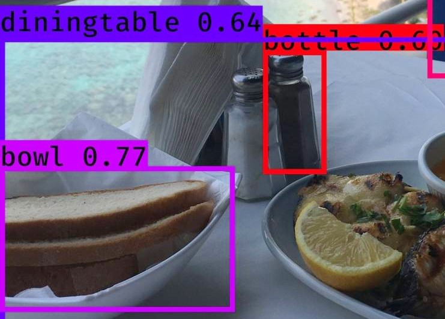

 

# Machine Learning and Deep learning scripts
The repository provides usefull python scripts for ML and DL

* [Classifications](https://github.com/Diyago/ML-DL-scripts/tree/master/DEEP%20LEARNING) - kaggle solutions, MOOC exercises, etc
* [Regression](https://github.com/Diyago/ML-DL-scripts/tree/master/regression)  - kaggle solutions, MOOC exercises, etc
* [Statistics](https://github.com/Diyago/ML-DL-scripts/tree/master/statistics) - essential tools to compare medians, means, data disturbution for statistical signifance
* [Clustering tasks](https://github.com/Diyago/ML-DL-scripts/tree/master/clustering) - useful cases for clustering tasks
* [Time series tasks](https://github.com/Diyago/ML-DL-scripts/tree/master/time%20series%20regression)
 
    a. [Anomaly detection](https://github.com/Diyago/ML-DL-scripts/tree/96825d152203ade61306f4afeeffcd31fc11b01c/time%20series%20regression/anomaly%20detection). [Medium article](https://medium.com/p/4c661f6f165f/)
   
    
    
    b. [DL aproach for timeseries](https://github.com/Diyago/ML-DL-scripts/tree/96825d152203ade61306f4afeeffcd31fc11b01c/time%20series%20regression/DL%20aproach%20for%20timeseries)
   
    c. [ARIMA](https://github.com/Diyago/ML-DL-scripts/tree/96825d152203ade61306f4afeeffcd31fc11b01c/time%20series%20regression/ARIMA)
 

* [Deep learning (pytorch, fastai, keras)](https://github.com/Diyago/ML-DL-scripts/tree/master/DEEP%20LEARNING)
  * [NLP](https://github.com/Diyago/ML-DL-scripts/tree/master/NLP)
  * Images
      * [Autoencoders, GANS](https://github.com/Diyago/ML-DL-scripts/tree/master/DEEP%20LEARNING/Autoencoders%20GANS)
        
        a. [Tabular GANs](https://github.com/Diyago/ML-DL-scripts/tree/96825d152203ade61306f4afeeffcd31fc11b01c/DEEP%20LEARNING/Autoencoders%20GANS/GAN-for-tabular-data)
        
        b. [Style transfer](https://github.com/Diyago/ML-DL-scripts/tree/96825d152203ade61306f4afeeffcd31fc11b01c/DEEP%20LEARNING/Autoencoders%20GANS/Style%20transfer)
      * [Image Classification:](https://github.com/Diyago/ML-DL-scripts/tree/master/DEEP%20LEARNING/image%20classification)
         
         a. [Fastai](https://github.com/Diyago/ML-DL-scripts/tree/master/DEEP%20LEARNING/image%20classification/fastai)
         
         b. [Keras](https://github.com/Diyago/ML-DL-scripts/tree/master/DEEP%20LEARNING/image%20classification/keras)
         
         c. [Pytorch](https://github.com/Diyago/ML-DL-scripts/tree/master/DEEP%20LEARNING/image%20classification)
         
          
      * [Object detection](https://github.com/Diyago/ML-DL-scripts/tree/master/DEEP%20LEARNING/Object%20detection)

      
        
      * [Pytorch tutorials](https://github.com/Diyago/ML-DL-scripts/tree/master/DEEP%20LEARNING/Pytorch%20from%20scratch)
      * [Segmentations tasks](https://github.com/Diyago/ML-DL-scripts/tree/master/DEEP%20LEARNING/segmentation)
        
        a. Kaggle solutions
        
        b. [Segmentation pipeline](https://github.com/Diyago/ML-DL-scripts/tree/master/DEEP%20LEARNING/segmentation/Segmentation%20pipeline). [Medium article](https://towardsdatascience.com/road-detection-using-segmentation-models-and-albumentations-libraries-on-keras-d5434eaf73a8)
       
        

* [Deployment](https://github.com/Diyago/ML-DL-scripts/tree/master/deployment) (docker)
 